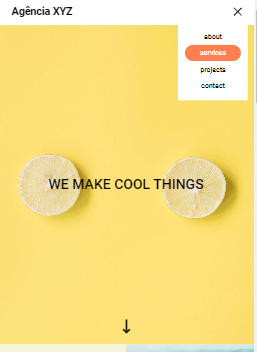

# Agência XYZ com GRID (Landing Page)

O projeto é uma representação de uma "landing page" com uma empresa fictícia utilizando grid como estrutura dos elementos. Feito com HTML e CSS.

## Menu

- [Screenshot](#screenshot)
- [Links](#links)
- [Feito com](#feito-com)
- [o que aprendi](#o-que-aprendi)
- [Autor](#autor)
- [Contato](#contato)

### Screenshot

### Links

- Site do projeto: [Projeto](https://bruno-nog.github.io/simple-omelette-recipe/)

### Feito com

- HTML5
- CSS3
- Grid

### O que aprendi

Uma landing  page é algo muito utilizado entre diversas empresas e algo essencial para se ter conhecimento e prática. Eta landing page foi feita com uma empresa fictícia e somente utilizando HTML e CSS. Pratiquei a responsividade do site, display grid, variaveis (no css), menu hamburguer, etc...

## Autor

- Frontend Mentor - [@Bruno-nog](https://www.frontendmentor.io/profile/Bruno-nog)

## Contato

